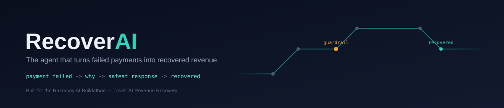
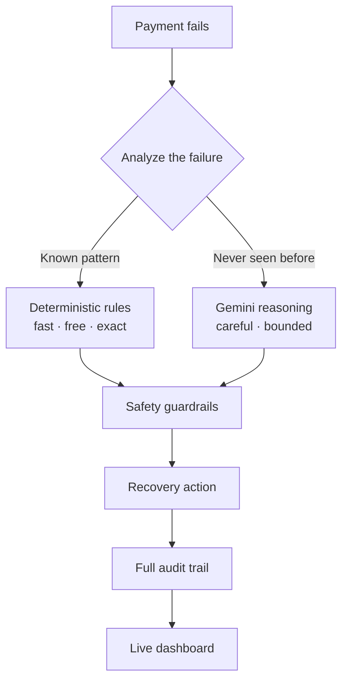
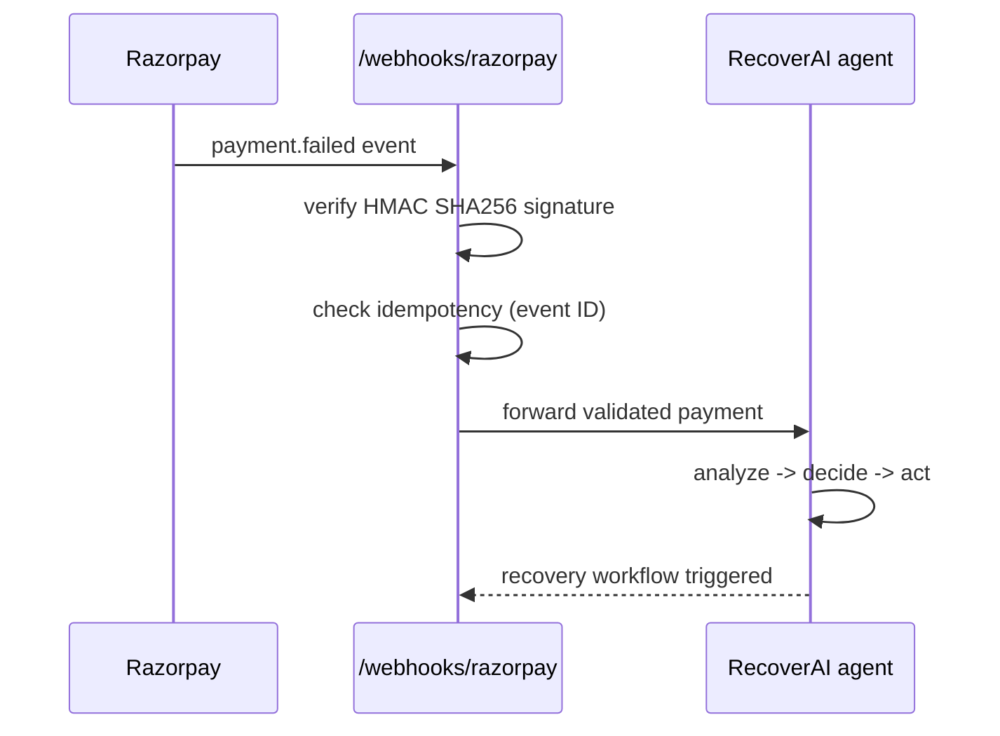

<div align="center">



<br/>


<br/>

**RecoverAI turns failed payments into recovered revenue — automatically, safely, and with a paper trail.**

</div>

<br/>

## Table of contents

- [The problem, in one line](#the-problem-in-one-line)
- [How it thinks](#how-it-thinks)
- [Guardrails before anything gets executed](#guardrails-before-anything-gets-executed)
- [The four recovery paths](#the-four-recovery-paths)
- [Razorpay webhook, secured end to end](#razorpay-webhook-secured-end-to-end)
- [Synthetic batch results](#synthetic-batch-results)
- [Every decision is inspectable](#every-decision-is-inspectable)
- [Live dashboard](#live-dashboard)
- [Tech stack](#tech-stack)
- [Project structure](#project-structure)
- [Getting started](#getting-started)
- [Why this exists](#why-this-exists)
- [What's next](#whats-next)

<br/>

## The problem, in one line

> A failed payment isn't lost revenue. It's an unanswered question: **what should happen next?**

Most systems treat every decline the same — retry blindly, or give up. RecoverAI looks at *why* a payment failed and picks the safest path to get it back, then writes down exactly why it made that call.

| Signal | Naive system | RecoverAI |
|---|---|---|
| Insufficient funds | Retry immediately (fails again) | Schedules a smarter retry later |
| Network blip | Escalate to a human | Retries instantly, no human needed |
| Card declined | Retry into a wall | Asks for a new payment method |
| ₹10,000+ payment | Automate anyway | Blocks automation → manual review |
| Never-seen-before failure | Guess | Reasons with an LLM, inside guardrails |

<br/>

## How it thinks

RecoverAI doesn't reach for an LLM on every payment — that's slow, expensive, and unpredictable. It reasons in **two speeds**: fast deterministic rules for patterns it already knows, and careful bounded LLM reasoning for the ones it doesn't.



Fast when it can be. Careful when it has to be. That combination is the whole design philosophy.

<br/>

## Guardrails before anything gets executed

Automating money movement demands hard limits, not good intentions. Every action passes through hard safety guardrails before it's allowed to run.

| Guardrail | What it enforces |
|---|---|
| 🔁 **Retry protection** | No infinite loops chasing a dead card. Max automatic retries: **2**. |
| 💰 **High-value protection** | Payments ≥ **₹10,000** always require human approval before recovery. |
| 🔒 **Closed action set** | Nothing runs that isn't explicitly allowed: `retry_now` · `retry_later` · `ask_for_another_payment_method` · `escalate`. Anything outside that set is **rejected before it ever executes** — not filtered afterward. |

<br/>

## The four recovery paths

| Path | Why |
|---|---|
| ⚡ **Retry Now** | Temporary failures — a network blip, a timeout. The fix is immediate, so the retry is too. |
| 🕒 **Retry Later** | Insufficient funds today doesn't mean insufficient funds Friday. Recovery gets scheduled, not forced. |
| 💳 **Request New Method** | The card itself is the problem. Ask the customer to swap it in. |
| 👤 **Escalate** | Unknown or high-risk. A human makes the call, not the agent. |

<br/>

## Razorpay webhook, secured end to end



- ✅ HMAC SHA256 signature verification on every webhook
- ✅ Idempotency via webhook event ID — duplicates can't double-process
- ✅ Secrets live in environment variables, never in code
- ✅ Every step is logged for audit

> **⚠️ Warning**
> Never commit API keys, webhook secrets, or `.env` files to the repository.

<br/>

## Synthetic batch results

A 100-payment synthetic batch, evaluated end to end:

| Metric | Result |
|---|---|
| Failed payments processed | 100 |
| Revenue at risk | ₹3,52,500 |
| Revenue recovered (simulated) | ₹67,500 |
| Recovery rate (simulated) | 19.15% |
| ⚡ Recovered | 30 |
| 🕒 Scheduled | 30 |
| 💳 Customer action required | 30 |
| 👤 Blocked for manual review | 10 |

The point isn't the headline number — it's that 100 identical-looking failures got routed **four different ways**, deliberately, instead of one generic retry-everything strategy.

> **ℹ️ Note**
> Synthetic simulation data. Not production performance metrics.

<br/>

## Every decision is inspectable

No black box. Each processed payment leaves a trail you can actually read:

```
pay_webhook_006
├── failure_reason : insufficient_funds
├── action_taken   : retry_later
├── status         : scheduled
└── reasoning      : logged, not guessed
```

<br/>

## Live dashboard

Built in Next.js, auto-refreshing straight from the backend API — no manual reloads, no stale numbers.

- 💰 Revenue recovered
- 📉 Revenue at risk
- 📈 Recovery rate
- ⚡ Recovery activity
- 👤 Blocked payments
- 🕒 Scheduled recoveries

<br/>

## Tech stack

| Layer | Stack |
|---|---|
| Backend | Python · FastAPI · LangGraph · SQLAlchemy · SQLite |
| AI reasoning | Google Gemini |
| Frontend | Next.js · React · TypeScript · CSS |
| Payments | Razorpay Webhooks + HMAC SHA256 |

<br/>

## Project structure

```
recover-ai/
├── .gitignore
├── backend/
│   ├── agent.py            # core agent logic
│   ├── agent_graph.py      # LangGraph orchestration
│   ├── analyzer.py         # failure classification
│   ├── database.py         # persistence layer
│   ├── guardrails.py       # safety limits
│   ├── main.py             # FastAPI entrypoint
│   ├── recovery.py         # recovery strategy execution
│   ├── schemas.py          # request/response models
│   ├── simulate_batch.py   # synthetic evaluation
│   ├── test_webhook.py     # webhook test harness
│   ├── webhook.py          # Razorpay webhook handler
│   └── requirements.txt 
├── frontend/
│   ├── app/
│   │   ├── globals.css
│   │   ├── layout.tsx
│   │   └── page.tsx
│   └── package.json
└── README.md
```

<br/>

## Getting started

<details>
<summary><b>1. Clone the repository</b></summary>
<br/>

```bash
git clone https://github.com/hassankadri/Recover-AI.git
cd recover-ai
```

</details>

<details>
<summary><b>2. Set up the backend</b></summary>
<br/>

```bash
cd backend

# create + activate a virtual environment
python -m venv venv
venv\Scripts\Activate.ps1      # Windows
source venv/bin/activate       # macOS / Linux

# install dependencies
pip install -r requirements.txt
```

Create a `.env` file in `backend/`:

```env
GEMINI_API_KEY=your_gemini_api_key
RAZORPAY_WEBHOOK_SECRET=your_webhook_secret
```

Start the server:

```bash
uvicorn main:app --reload
```

Backend runs at → `http://127.0.0.1:8000`

</details>

<details>
<summary><b>3. Set up the frontend</b></summary>
<br/>

```bash
cd frontend
npm install
npm run dev
```

Dashboard runs at → `http://localhost:3000`

</details>

<details>
<summary><b>4. Run the synthetic evaluation</b></summary>
<br/>

```bash
cd backend
python simulate_batch.py
```

Generates a synthetic batch of failed payments and runs them through the full recovery workflow — no real payment data required.

</details>

<details>
<summary><b>5. Test the webhook flow</b></summary>
<br/>

```bash
cd backend
python test_webhook.py
```

Sends a signed, synthetic `payment.failed` event through the same HMAC-verified path a real Razorpay webhook would take.

</details>

<br/>

## Why this exists

Most payment systems stop at "payment failed." RecoverAI keeps asking:

```
payment failed -> why? -> what's the safest response? -> can it be automated?
                -> did it work? -> can we explain what happened?
```

The goal was never to bolt a chatbot onto a payments dashboard. It's to build a system that makes bounded decisions, takes controlled actions, measures what actually happened, and can explain itself when asked.

<br/>

## What's next

- [ ] Real Razorpay payment retry execution
- [ ] Customer-specific recovery timing
- [ ] AI-generated recovery messages
- [ ] WhatsApp / SMS recovery workflows
- [ ] Subscription recovery flows
- [ ] Payment-method optimization
- [ ] A/B testing across recovery strategies
- [ ] Strategy learning from historical outcomes
- [ ] Production-grade PostgreSQL persistence
- [ ] Distributed event processing
- [ ] Deeper revenue recovery analytics

<br/>

> **⚠️ Disclaimer**
> RecoverAI is a buildathon prototype, evaluated on synthetic data. The results above are simulated and do not reflect production performance or real customer revenue. No real payment credentials or production data should be used with this project.

<br/>

<div align="center">

**RecoverAI** — turning payment failures into intelligent recovery decisions.

</div>
